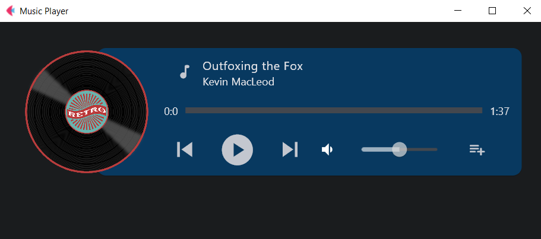

# Music-Player-Flet
A Music Player App made with Flet Framework

#### Install All Packages from a requirements.txt File Using pip and Python:

<code>pip install -r requirements.txt</code>

#### Screenshot:

